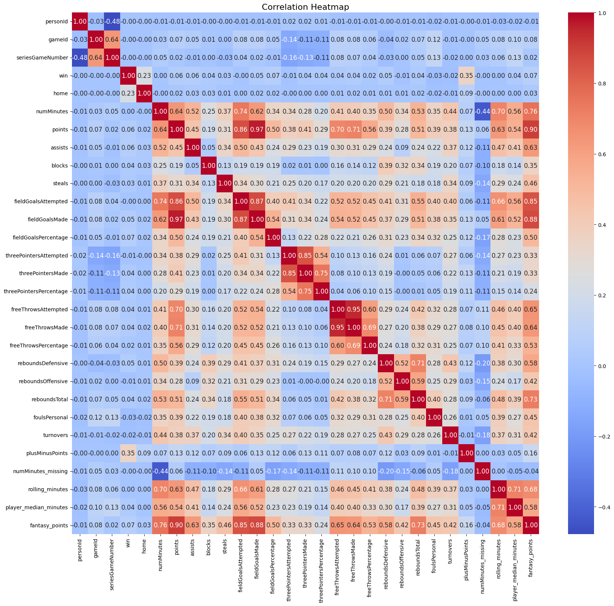
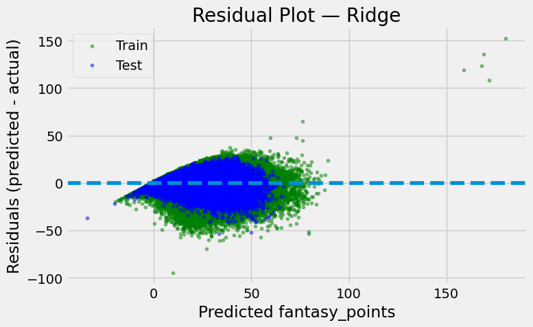
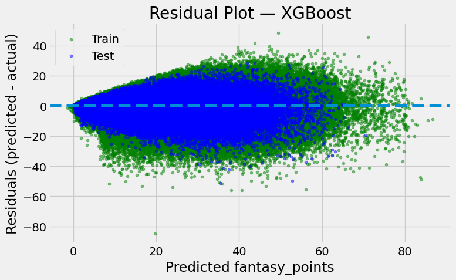

# 🏀 NBA Fantasy Points Prediction

## 📄 Overview

This project builds a machine learning model to predict how many fantasy points an NBA player will score in their next game.

The model leverages:

- recent player performance
- playing time (minutes)
- efficiency metrics
- contextual information (e.g. playoffs, home games)

The goal is to understand which factors drive player performance and build a reliable predictive pipeline.

## 📊 Dataset

Source: Kaggle NBA Dataset
Includes:
- Player box scores
- Team statistics
- Game metadata
- Schedule information
- Data Challenges
- Missing or inconsistent minutes played
- Players with zero minutes but non-zero stats
- Cold-start players (rookies / limited history)
- Temporal dependencies (time-series nature)

## 🔍 Methodology
### 1. Target Definition

Fantasy points are computed using a standard weighted formula:

- FP= points + 1.2 * rebounds + 1.5 * assists + 2 * steals + 2 * blocks − 0.5 * turnovers

The task is to predict fantasy points for the next game.

### 2. Time-Aware Setup

- Data sorted by player_id and game_date
- Rolling features computed using past games only
- Shift applied to avoid data leakage
- Train/test split based on time:
- Training → older seasons
- Testing → recent seasons

### 3. Feature Engineering

Features were built incrementally to evaluate their impact.

#### 🔹 Group A — Player Form (Rolling Stats)

Rolling averages (last 5 games):

 - Points
 - Assists
 - Rebounds
 - Steals
 - Blocks
 - Turnovers

👉 Captures recent performance

#### 🔹 Group B — Opportunity (Minutes)
 - Rolling minutes
 - Player median minutes
 - Missing minutes flag

👉 Key insight:

Minutes represent opportunity, which strongly drives fantasy output

#### 🔹 Group C — Context
 - Home vs away
 - Playoff indicator

#### 🔹 Advanced Features
Efficiency:
- fantasy_points_per_min
- Interaction (key improvement):
- expected_fp = fp_per_min × minutes

##### 👉 This models:

Fantasy Points ≈ Efficiency × Opportunity

### 4. Handling Missing Data
 - Initial approach: imputation with 0 → led to biased results
 - Final approach: drop rows with missing rolling features

##### 👉 Important lesson:

Missing values represent lack of history, not poor performance

#### 🔥 Correlation Heatmap

## 🤖 Models

### 1. Ridge Regression (Baseline)
 - Handles multicollinearity between rolling features
 - Strong performance due to mostly linear relationships

### 2. Random Forest
- Tested but underperformed

### 3. XGBoost (Final Model)
 - Captures nonlinear interactions
 - Achieved best performance after feature engineering

####  📈 Results

| Model  | RMSE | R² |
| ------------- | ------------- | --------- |
| Ridge Regression  | ~7.30  | ~0.75 | 
| XGBoost  | ~7.17  | ~0.76 |

## 📊 Model Evaluation

Residual analysis was used to assess model quality:

 - Residuals centered around 0 → low bias
 - No strong patterns → good fit
 - Spread indicates prediction uncertainty

   

## 🧠 Key Insights

- Minutes played is the strongest driver of fantasy points

- Performance is largely:

  - linear + interaction-based (efficiency × opportunity)

- Feature engineering provided larger gains than model complexity
- Avoiding data leakage is critical in time-based problems

## 🚀 Future Improvements

- Hyperparameter tuning (XGBoost)
- Additional contextual features (opponent strength, advanced shooting metrics, defensive stats, or player efficiency ratings)
- Player-level embeddings
- Advanced time-series models

## 🧩 Tech Stack
- Python
- Pandas / NumPy
- Scikit-learn
- XGBoost
- Matplotlib / Seaborn